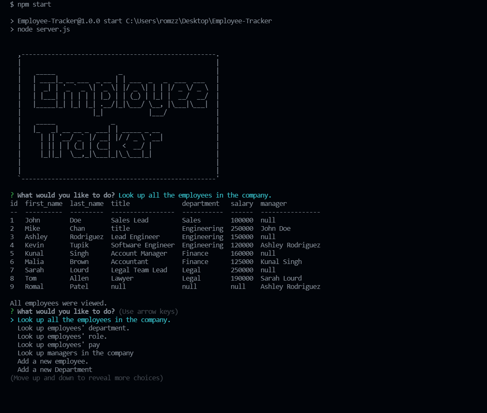

# Employee Team Builder

# Table Contents

- [Project Summary](#Summary)
- [Questions](#Questions)
- [Github](#Repo)
- [Screenshot](#Deployed)
- [Video](#VideoDemo)

# Project Summary

This app demonstrates the Employee management system using the NODE.js CLI. The user here is prompted with the questions viewing data about the employees, depatments, salary, role, manager. The user can also make changes to this information as well.

# Questions:

Any questions regarding this project can be directed at me via:

- [Github Profile](https://github.com/romzzp)
- Email: romzz.patel@gmail.com

# Github:

- [Repository](https://github.com/romzzp/Employee-Tracker)

# Screenshot:

# Video

https://watch.screencastify.com/v/HG9dZ8NGOSFFs97ZO5il
